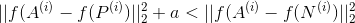

# 人脸识别
这是一个用卷积神经网络模型识别人脸的有趣方法，大部分想法来自于[FaceNet](https://arxiv.org/pdf/1503.03832.pdf)。

**point**
- triplet loss
- 人脸编码

## 1 - 人脸编码
我们将用到 FaceNet 的预训练模型，把人脸输入图片转换成一个 128 维的编码向量。这个模型来自于 [Szegedy et al](https://arxiv.org/pdf/1409.4842.pdf) 的最初模型，你可以在  [inception_blocks.py](./inception_blocks_v2.py) 里看到模型的框架。

这个神经网络用的是 96\*96 的RGB入图像作为输入。需要注意的是通道优先的规则，输入张量的形状为 (m, nC, nH, nW)=(m, 3, 96, 96)。
输出是一个 (m, 128) 的编码矩阵。
 
最后，通过计算最后输出的 128 维的人脸编之间的距离，来判断两张图片的相似度。


```python
from keras.models import Sequential
from keras.layers import Conv2D, ZeroPadding2D, Activation, Input, concatenate
from keras.models import Model
from keras.layers.normalization import BatchNormalization
from keras.layers.pooling import MaxPooling2D, AveragePooling2D
from keras.layers.merge import Concatenate
from keras.layers.core import Lambda, Flatten, Dense
from keras.initializers import glorot_uniform
from keras.engine.topology import Layer
from keras import backend as K
K.set_image_data_format('channels_first')
import cv2
import os
import numpy as np
from numpy import genfromtxt
import pandas as pd
import tensorflow as tf
from fr_utils import *
from inception_blocks_v2 import *
```

```python
FRmodel = faceRecoModel(input_shape=(3, 96, 96))

print("Total Params:", FRmodel.count_params())

# Total Params: 3743280
```

## 2 - Triplet loss
Triplet loss 是训练模型用到的损失函数，它的作用是试图计算出同一个人的两张图片的编码距离更近，而不同人之间图片编码距离更远。

我们将人脸图像分为三类：A, P, N，其中

- A 代表 “Anchor” ，表示用于比对的基准人脸图像 （比如，李蛋1）
- P 代表 “Positive”， 表示和 A 相似的人脸图像 （比如，李蛋2）
- N 代表 “Negative”， 表示和 A 不同的人脸图像 （比如，建国1）

triplet 的目的是确保 A 和 P 相对于 A 和 N 足够近。这里用 L2 范数，同时加一个 保证超参数 a, 使得

