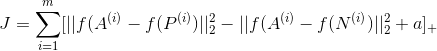

# 人脸识别
这是一个用卷积神经网络模型识别人脸的有趣方法，大部分想法来自于[FaceNet](https://arxiv.org/pdf/1503.03832.pdf)。

**point**
- triplet loss
- 人脸编码

## 1 - 人脸编码
我们将用到 FaceNet 的预训练模型，把人脸输入图片转换成一个 128 维的编码向量。这个模型来自于 [Szegedy et al](https://arxiv.org/pdf/1409.4842.pdf) 的最初模型，你可以在  [inception_blocks.py](./inception_blocks_v2.py) 里看到模型的框架。

这个神经网络用的是 96\*96 的RGB入图像作为输入。需要注意的是通道优先的规则，输入张量的形状为 (m, nC, nH, nW)=(m, 3, 96, 96)。
输出是一个 (m, 128) 的编码矩阵。
 
最后，通过计算最后输出的 128 维的人脸编之间的距离，来判断两张图片的相似度。


```python
from keras.models import Sequential
from keras.layers import Conv2D, ZeroPadding2D, Activation, Input, concatenate
from keras.models import Model
from keras.layers.normalization import BatchNormalization
from keras.layers.pooling import MaxPooling2D, AveragePooling2D
from keras.layers.merge import Concatenate
from keras.layers.core import Lambda, Flatten, Dense
from keras.initializers import glorot_uniform
from keras.engine.topology import Layer
from keras import backend as K
K.set_image_data_format('channels_first')
import cv2
import os
import numpy as np
from numpy import genfromtxt
import pandas as pd
import tensorflow as tf
from fr_utils import *
from inception_blocks_v2 import *
```

```python
FRmodel = faceRecoModel(input_shape=(3, 96, 96))

print("Total Params:", FRmodel.count_params())

# Total Params: 3743280
```

## 2 - Triplet loss
Triplet loss 是训练模型用到的损失函数，它的作用是试图计算出同一个人的两张图片的编码距离更近，而不同人之间图片编码距离更远。

我们将人脸图像分为三类：A, P, N，其中

- A 代表 “Anchor” ，表示用于比对的基准人脸图像 （比如，李蛋1）
- P 代表 “Positive”， 表示和 A 相似的人脸图像 （比如，李蛋2）
- N 代表 “Negative”， 表示和 A 不同的人脸图像 （比如，建国1）

triplet 的目的是确保 A 和 P 相对于 A 和 N 足够近。这里用 L2 范数，同时加一个 保证超参数 a, 使得

<br>

所以，批量计算的最小化损失为<br>



其中，符号\[z]+表示 max(z, 0)，确保损失为非负数，a这里使用0.2。

```python
# 三元损失
def triplet_loss(y_true, y_pred, alpha = 0.2):
    """
    三元损失实现
    
    参数:
    y_true -- 正确的标签, 和此函数无关
    y_pred -- python list 包含三个对象:
            anchor -- A 的编码, 形状 (None, 128)
            positive -- P 的编码, 形状 (None, 128)
            negative -- N 的编码, 形状 (None, 128)
    
    返回:
    损失 -- 实数
    """
    
    anchor, positive, negative = y_pred[0], y_pred[1], y_pred[2]
    
    # 计算 A 和 P
    pos_dist = tf.reduce_sum(tf.square(tf.subtract(anchor,positive)),axis=-1) 
    # 计算 A 和 N
    neg_dist = tf.reduce_sum(tf.square(tf.subtract(anchor,negative)),axis=-1)
    # 损失
    basic_loss = pos_dist - neg_dist + alpha
    loss = tf.reduce_sum(tf.maximum(basic_loss , 0.0))
    
    return loss
```

## 3 - 加载预训练模型

FaceNet 模型用是上面定义的 triplet 损失函数，我们编译下模型。

```python
FRmodel.compile(optimizer = 'adam', loss = triplet_loss, metrics = ['accuracy'])
load_weights_from_FaceNet(FRmodel)
```

## 4 -测试

在测试前，我们构建一个数据编码库，作为比对库。

```python
database = {}
database["danielle"] = img_to_encoding("images/danielle.png", FRmodel)
database["younes"] = img_to_encoding("images/younes.jpg", FRmodel)
database["tian"] = img_to_encoding("images/tian.jpg", FRmodel)
database["andrew"] = img_to_encoding("images/andrew.jpg", FRmodel)
database["kian"] = img_to_encoding("images/kian.jpg", FRmodel)
database["dan"] = img_to_encoding("images/dan.jpg", FRmodel)
database["sebastiano"] = img_to_encoding("images/sebastiano.jpg", FRmodel)
database["bertrand"] = img_to_encoding("images/bertrand.jpg", FRmodel)
database["kevin"] = img_to_encoding("images/kevin.jpg", FRmodel)
database["felix"] = img_to_encoding("images/felix.jpg", FRmodel)
database["benoit"] = img_to_encoding("images/benoit.jpg", FRmodel)
database["arnaud"] = img_to_encoding("images/arnaud.jpg", FRmodel)
```

定义测试函数

```python
def who_is_it(image_path, database, model):
    """
    对一张新图片与数据编码库匹配，进行识别
    
    参数:
    image_path -- 新图片
    database -- 编码数据库
    model -- 预训练模型
    
    返回:
    min_dist -- 与编码库匹配的最小距离
    identity -- 字符串，匹配到的姓名
    """
    
    encoding = img_to_encoding(image_path, model)
    # 初始化距离为100
    min_dist = 100
    # 循环匹配
    for (name, db_enc) in database.items():
        dist = np.linalg.norm(encoding-db_enc)
        if dist < min_dist:
            min_dist = dist
            identity = name 
    if min_dist > 0.7:
        print("Not in the database.")
    else:
        print ("it's " + str(identity) + ", the distance is " + str(min_dist))
        
    return min_dist, identity
```

```python
who_is_it("images/camera_0.jpg", database, FRmodel)

# it's younes, the distance is 0.659393
```

## 提升算法的一些方法
- 将每个人的更多图像（在不同的照明条件下，在不同的日子拍摄等）放入数据库。然后给一个新的图像，比较新的面孔和多张照片的人。这将提高准确性。
- 裁剪图像，使其仅包含脸面，而不包含面周围的“边界”区域。这种预处理去除了面部周围的一些不相关的像素，并且使算法更加健壮。

## 相关资料
- Florian Schroff, Dmitry Kalenichenko, James Philbin (2015). [FaceNet: A Unified Embedding for Face Recognition and Clustering](https://arxiv.org/pdf/1503.03832.pdf)
- Yaniv Taigman, Ming Yang, Marc'Aurelio Ranzato, Lior Wolf (2014). [DeepFace: Closing the gap to human-level performance in face verification](https://research.fb.com/wp-content/uploads/2016/11/deepface-closing-the-gap-to-human-level-performance-in-face-verification.pdf) 
- The pretrained model we use is inspired by Victor Sy Wang's implementation and was loaded using his code:https://github.com/iwantooxxoox/Keras-OpenFace.
- Our implementation also took a lot of inspiration from the official FaceNet github repository: https://github.com/davidsandberg/facenet
