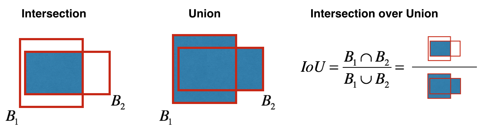
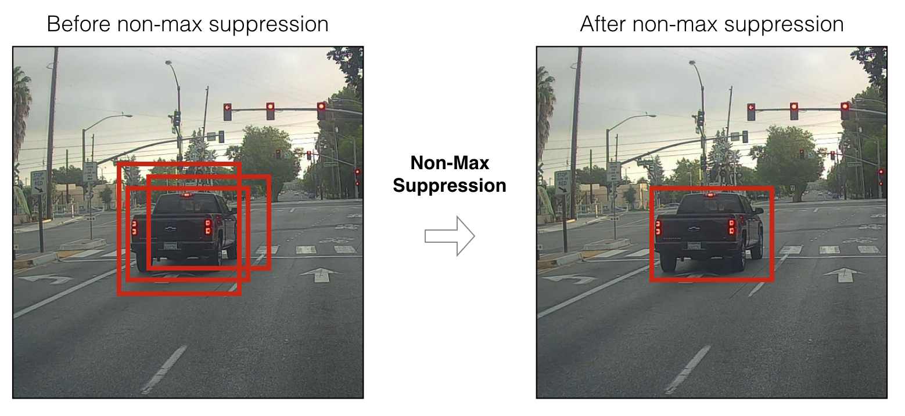

# 目标检测 - 汽车识别
Yolo（“you only look once”）是一种流行的算法，因为它既能实现高精度，又能实时运行。这种算法“只看一次”图像，因为它只需要一个正向传播通过网络进行预测。在非最大抑制之后，它将识别的对象与边界框一起输出。

**point**
- 交并比（IOU）
- 非最大值抑制（NMS）
- anchor boxes

## 1 - 问题描述
Yolo 通过对图片中不同类别的对象检测，以边界框的形式进行标注。如图所示：

其中，p_c 表示为识别出对象的概率，在0-1范围内,b_x, b_y, b_h, b_w 表示为边界框的坐标比例，c 表示为识别的类别，如果有80个类别，那么 c 可以表示为一个80维的向量，其中对应的类别为 1，其他为 0。

## 2 - 模型细节
YOLO模型的输入是一个(m, 608, 608, 3)张量。
输出是一个包含所有边界框的列表，其中每个边界框为(pc,bx,by,bh,bw,c)。

如果有个5个anchor boxes，那么可以认为YOLO完成类似下面这种转换：IMAGE (m, 608, 608, 3) -> DEEP CNN -> ENCODING (m, 19, 19, 5, 85).

因为我们用了定义了 5 个anchor boxes，所以19*19的每个格子里都包含 5 个boxes的编码。简单起见，我们把(19, 19, 5, 85)最后两个维度进行展平操作，所以输出的shape为（19, 19, 425）。

然后，对每个 box，我们计算 pc 和 c 中每个类别的元素积，用于过滤掉没有识别到对象的 box。


## 3 - 类别过滤
我们定义一个过滤阈值，作元素积后小于过滤阈值的类别将会被过滤掉。
计算过程如下：

a = np.random.randn(19\*19, 5, 1)<br>
b = np.random.randn(19\*19, 5, 80)<br>
c = a * b

```python
def yolo_filter_boxes(box_confidence, boxes, box_class_probs, threshold = .6):
    """
    参数:
    box_confidence -- (19, 19, 5, 1)，pc
    boxes -- (19, 19, 5, 4)，(bx, by, bh, bw)
    box_class_probs --  (19, 19, 5, 80)，(c1,c2...c80)
    threshold -- 过滤阈值
    
    Returns:
    scores -- 类别分数
    boxes -- 边界框
    classes -- 类别分数索引
    """

    # 计算box_socres
    box_scores = box_confidence * box_class_probs
    # 找出box最大socre的索引
    box_classes = K.argmax(box_scores, axis=-1)
    # 找出box最大socre最大索引对应的分数
    box_class_scores = K.max(box_scores, axis=-1)
    # 对box_class_scores阈值过滤
    filtering_mask = box_class_scores >= threshold
    # 保留过滤后的数据
    scores = tf.boolean_mask(box_class_scores, filtering_mask)
    boxes = tf.boolean_mask(boxes, filtering_mask)
    classes = tf.boolean_mask(box_classes, filtering_mask)

    return scores, boxes, classes

```

## 4 - 交并比
交并比是指两个边框覆盖面积的交集和并集之比，它是非最大值抑制用于判断边框准确度的方法。


```python
def iou(box1, box2):
    # 计算box1, box2的交集面积
    xi1 = max(box1[0],box2[0])
    yi1 = max(box1[1],box2[1])
    xi2 = min(box1[2],box2[2])
    yi2 = min(box1[3],box2[3])
    inter_area = abs((yi2-yi1)*(xi2-xi1))
    # 计算box1, box2的并集面积
    box1_area = abs((box1[1]-box1[3])*(box1[0]-box1[2]))
    box2_area = abs((box2[1]-box2[3])*(box2[0]-box2[2]))
    union_area = box1_area+box2_area-inter_area
    # 计算交并比
    iou = inter_area*1.0/union_area

    return iou
```

## 5 - 非最大值抑制
在过滤出多余的 box 后，仍会有一些重叠的边界框，这时要需要第二种过滤方法，成为非最大值抑制。


具体方法是：
1. 选出类别过滤中分数最高的 box。
2. 计算这个box 和 其他重叠的 box 之间的交并比，过滤出低于交并比阈值的 box。
3. 返回到步骤1并迭代，直到没有比当前所选框得分低的框。

```python
def yolo_non_max_suppression(scores, boxes, classes, max_boxes = 10, iou_threshold = 0.5):
    """
    参数:
    scores -- 类别过滤后的分数
    boxes -- 类别过滤后的边框
    classes -- 类别过滤后的分数索引
    max_boxes -- 边界框上限
    iou_threshold -- 交并比阈值
    
    返回:
    scores -- NMS后的分数
    boxes -- NMS后的边界框
    classes -- NMS后的类别索引
    
    """

    max_boxes_tensor = K.variable(max_boxes, dtype='int32')
    K.get_session().run(tf.variables_initializer([max_boxes_tensor]))
    # 通过tf.image.non_max_suppression()函数得到过滤后保存框对应的索引列表
    nms_indices = tf.image.non_max_suppression(boxes,scores,max_boxes,iou_threshold)
    # 保存对应索引的值
    scores = K.gather(scores,nms_indices)
    boxes = K.gather(boxes,nms_indices)
    classes = K.gather(classes,nms_indices)

    return scores, boxes, classes
```

## 6 - 封装
Yolo模型可以运行608x608图像。如果输入不同的尺寸（例如，汽车检测数据集有720x1280个图像），需要先进行转换：

```python
def yolo_eval(yolo_outputs, image_shape = (720., 1280.), max_boxes=10, score_threshold=.6, iou_threshold=.5):
    """
    将yolo编码的输出（许多框）转换为预测框，以及它们的分数、框坐标和类。
    
    参数:
    yolo_outputs -- 输出编码：
                    box_confidence:  (None, 19, 19, 5, 1)
                    box_xy:  (None, 19, 19, 5, 2)
                    box_wh:  (None, 19, 19, 5, 2)
                    box_class_probs:  (None, 19, 19, 5, 80)
    image_shape -- 输入图片的形状
    max_boxes -- 最大预测边界框数目
    score_threshold -- 类别过滤阈值
    iou_threshold -- 交并比阈值
    
    Returns:
    scores -- 分数
    boxes -- 边界框
    classes -- 类别
    """

    # 从YOLO模型中获取输出
    box_confidence, box_xy, box_wh, box_class_probs = yolo_outputs
    # 转换box数据
    boxes = yolo_boxes_to_corners(box_xy, box_wh)
    # 过滤输出
    scores, boxes, classes = yolo_filter_boxes(box_confidence, boxes, box_class_probs, threshold = score_threshold)
    # 转换分辨率
    boxes = scale_boxes(boxes, image_shape)
    # 非最大值抑制
    scores, boxes, classes = yolo_non_max_suppression(scores, boxes, classes, max_boxes, iou_threshold)

    return scores, boxes, classes
```

**YOLO 总结**：
- 输入图像（608、608、3）。
- 输入图像通过CNN，产生（19、19、5、85）尺寸输出。
- 压平最后两个维度后，输出是一个形状的体积（19、19、425）：
  - 输入图像上方19x19网格中的每个单元格给出425个数字。
  - 425 = 5 x 85，因为每个单元格包含5个框的预测，对应于5个anchor box。
  - 85 = 5 + 80，其中5是因为（pc，bx，by，bh，bw）有5个数字，80是我们要检测的类的数量。
- 然后，您只能根据以下条件选择几个框：
  - 分数阈值：丢弃检测到分数低于阈值的类的框。
  - 非最大抑制：计算并集上的交集，避免选择重叠框。
- 得到Yolo的最终输出。
